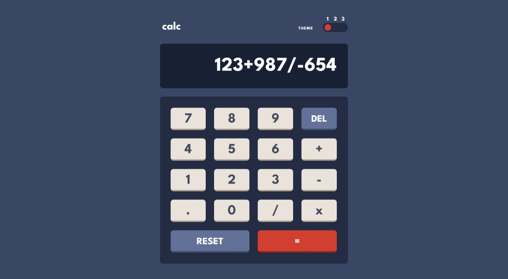
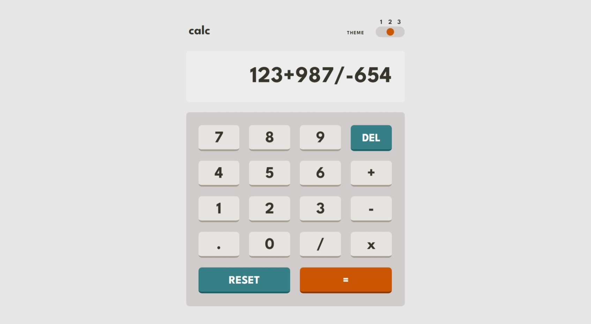
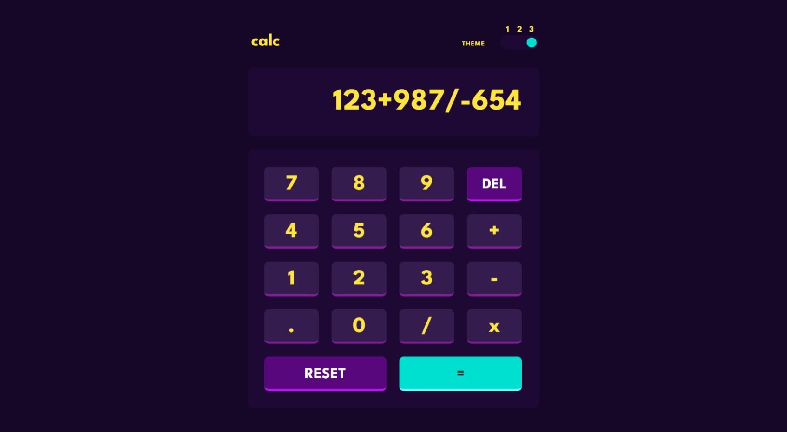
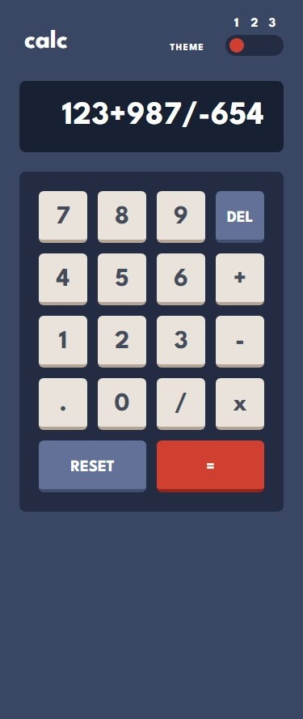
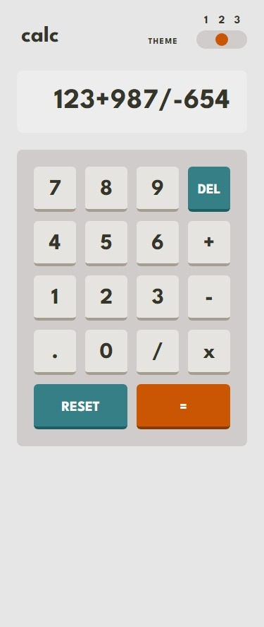

# Frontend Mentor - Calculator app solution

This is a solution to the [Calculator app challenge on Frontend Mentor](https://www.frontendmentor.io/challenges/calculator-app-9lteq5N29). Frontend Mentor challenges help you improve your coding skills by building realistic projects. 

## Table of contents

- [Overview](#overview)
  - [The challenge](#the-challenge)
  - [Screenshot](#screenshot)
  - [Links](#links)
- [My process](#my-process)
  - [Built with](#built-with)  
- [Author](#author)

## Overview

### The challenge

Users should be able to:

- See the size of the elements adjust based on their device's screen size
- Perform mathmatical operations like addition, subtraction, multiplication, and division
- Adjust the color theme based on their preference
- **Bonus**: Have their initial theme preference checked using `prefers-color-scheme` and have any additional changes saved in the browser

### Screenshot
 
#### Desktop

- Theme 1

- Theme 2

- Theme 3

#### Mobile

- Theme 1

- Theme 2

- Theme 3

### Links

- Solution URL: [Github](https://github.com/anindyoo/fe-mentor-6-calculator-app)
- Live Site URL: [Github Pages](https://anindyoo.github.io/fe-mentor-6-calculator-app/)

## My process

### Built with

- Semantic HTML5 markup
- [Tailwind CSS](https://tailwindcss.com/)
- [React](https://reactjs.org/) - JS library
- [ESLint](https://eslint.org/) - Linting tool
- [Zustand](https://zustand-demo.pmnd.rs/) - State management tool

## Author

- Frontend Mentor - [@anindyoo](https://www.frontendmentor.io/profile/anindyoo)
- Twitter - [@anindyo_](https://www.twitter.com/anindyo_)
